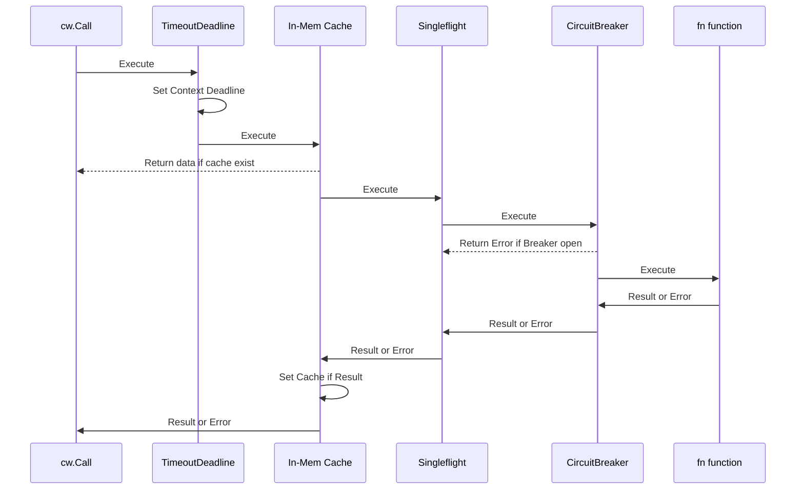

# go-callwrapper

go-callwrapper is basically a wrapper function designed to perform external calls, implementing commonly used
distributed system pattern best practices to achieve stability and resilience:

## Features

- [Circuit Breaker Pattern](#circuit-breaker-pattern)
- [LRU (Least Recently Used) In-Memory Cache Pattern](#lru-in-memory-cache-pattern)
- [Singleflight Pattern](#singleflight-pattern)
- [Request Timeout](#request-timeout-deadline)

## Circuit Breaker Pattern

The Circuit Breaker pattern is a design pattern used in software engineering to improve the stability and resilience of
applications, particularly in distributed systems. It acts like an electrical circuit breaker, preventing an application
from trying to execute an operation that is likely to fail.

### When to Use this Pattern

**Use this pattern:**

- To prevent an application from attempting to invoke an external service or access a shared resource if this operation
  is highly likely to fail.

**This pattern might not be suitable:**

- For handling access to local private resources in an application, such as in-memory data structure. In this
  environment, using a circuit breaker would simply add overhead to your system.
- As a substitute for handling exceptions in the business logic of your applications.

<p align="right">(
<a href="https://learn.microsoft.com/en-us/previous-versions/msp-n-p/dn589784(v=pandp.10)">reference</a>
)</p>

## LRU In-Memory Cache Pattern

In-memory caching patterns are techniques used to temporarily store frequently accessed data in memory to improve
application performance and reduce latency. In this callwrapper package will implement Least Recently Used (LRU) policy.
The LRU Cache operates on the principle that the data most recently accessed is likely to be accessed again in the near
future. By evicting the least recently accessed items first, LRU Cache ensures that the most relevant data remains
available in the cache.

### When to Use this Pattern

**Use this pattern:**

- When certain data is accessed repeatedly within a short period.
- If retrieving data involves costly computations or time-consuming operations, caching can help reduce these costs.
- Data that doesn't change often or is predictable (like configurations) is ideal for caching.
- In scenarios where latency is critical, such as real-time applications, caching can lead to noticeable improvements.

**This pattern might not be suitable:**

- On highly dynamic data or when the source data changes frequently, caching can lead to stale data being served to
  users unless properly invalidated. Or in write-heavy applications, caching might not provide significant benefits, as
  data is often being changed rather than read.

<p align="right">(
<a href="https://redis.io/glossary/lru-cache/">reference</a>
)</p>

## Singleflight Pattern

Singleflight pattern is a concurrency pattern designed to prevent duplicate function calls for the same key when
multiple goroutines request the same resource. It ensures that the function is executed only once, and the result is
shared among all callers.

### When to Use this Pattern

**Use this pattern:**

- To reducing load, it can be used to reduce load on external services or databases by ensuring that requests for the
  same data are consolidated.
- To preventing duplicate work, use singleflight when you have expensive computations or any function
  that should only be executed once for a given key, even if requested by multiple goroutines concurrently.

**This pattern might not be suitable:**

- If the requests are unique and have different parameters or need unique handling, single-flight might not be
  appropriate since it groups requests. It also adds complexity so if the benefits call not outweigh the overhead.

<p align="right">(
<a href="https://victoriametrics.com/blog/go-singleflight/">reference-1</a>
<a href="https://www.codingexplorations.com/blog/understanding-singleflight-in-golang-a-solution-for-eliminating-redundant-work">reference-2</a>
)</p>

## Request Timeout Deadline

It is not a pattern, but to manage deadlines, cancellation signals, and request-scoped values across API boundaries.
Using golang context with a timeout is a context that automatically cancels after a specified duration. This is useful
for operations that may take an uncertain amount of time and helps prevent resource leaks and unresponsive programs.

<p align="right">(
<a href="https://pkg.go.dev/context#WithTimeout">reference</a>
)</p>


## Architectural Flow Diagram Design

when all features are enabled, the execution func described as follows:



## Quick Start

the callwrapper provides a simple way with 2 steps:

1. create the call wrapper instance as `cw`

```go

cw := callwrapper.New(callwrapper.Config{
TimeoutDeadline: 500, // in milliseconds
Singleflight: true,
})

```

2. use the `cw` instance to perform external call

```go
resp, err := cw.Call(ctx, callKey, func (ctx context.Context) (interface{}, error) {
return getData(ctx)
})
```

## Configuration

```
TBD
```

## Example Usage

check example folder to see detailed implementation use cases.

- how to perform external call with callwrapper ([example](https://github.com/rizanw/go-callwrapper/blob/main/example/repo.go))
- when you need to have set deadline call ([example usage](https://github.com/rizanw/go-callwrapper/blob/main/example/ttl.go))
- when you need to reduce upstream load with singleflight ([example usage](https://github.com/rizanw/go-callwrapper/blob/main/example/singleflight.go))
- when you need to fetch frequent access and rarely changes data using in-memory cache ([example usage](https://github.com/rizanw/go-callwrapper/blob/main/example/cache.go))
- when you need to prevent likely fail request with circuit-breaker ([example usage](https://github.com/rizanw/go-callwrapper/blob/main/example/circuitbreaker.go))
